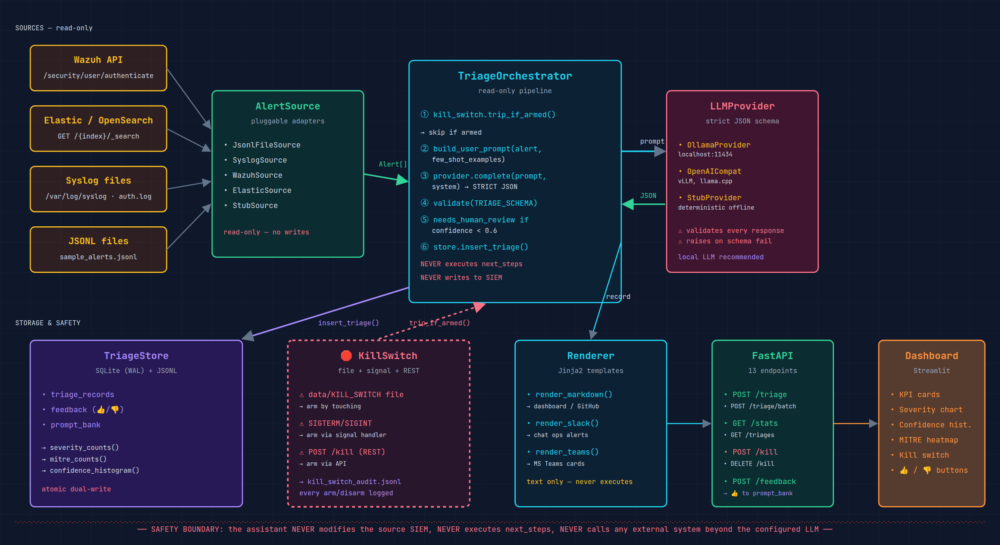

# LLM-Powered SOC Triage Assistant

A **read-only** FastAPI service that watches a SIEM / log pipeline, fans each alert to a local LLM (Ollama or vLLM, or a stub for testing), and returns a Markdown triage note. The assistant **NEVER takes action on its own** — it only reads, classifies, and recommends. A **kill switch** drops it back to passthrough mode instantly.

 *(see docs/ARCHITECTURE.md)*

Built from **Project 5.X** of the *2026 AI × Cybersecurity project catalogue*. Designed to be the kind of defensive tool a compliance team would approve.

## Quick start (zero infrastructure)

The default provider is a deterministic **stub** — no Ollama, no vLLM, no Docker required. The full pipeline (alert → schema validation → triage record → kill switch → feedback) works end-to-end on a fresh checkout.

```bash
git clone https://github.com/MohitDholakiya/llm-soc-triage
cd llm-soc-triage
python3 -m venv .venv && source .venv/bin/activate
pip install -e ".[dev]"

# 1. Run the test suite (63 tests, no external infra needed)
pytest

# 2. Start the API
python -m uvicorn soc_triage.server:app --reload --port 8000

# 3. In another terminal — fire a sample alert
curl -X POST localhost:8000/triage \
  -H 'Content-Type: application/json' \
  -d '{"alert": {"alert_id": "demo-1", "host": "web-prod-01", "src_ip": "203.0.113.42", "event_type": "ssh_brute_force", "severity": "10", "message": "47 SSH failed logins"}}'

# 4. Open the dashboard
streamlit run src/soc_triage/dashboard.py

# 5. Hit the kill switch (file-based; or POST /kill)
touch data/KILL_SWITCH
```

## Quick start (with Ollama)

```bash
# 1. Install Ollama + a small model
curl -fsSL https://ollama.com/install.sh | sh
ollama pull llama3.1:8b          # or qwen2.5:7b

# 2. Set the provider (auto-detects Ollama at localhost:11434)
export SOC_TRIAGE_PROVIDER=ollama
export OLLAMA_MODEL=llama3.1:8b

# 3. Start the API — it'll use the real LLM now
python -m uvicorn soc_triage.server:app --port 8000
```

## What it does

| Endpoint | Purpose |
|---|---|
| `POST /triage` | Triage a single alert. Returns the row id, the full record, and the Markdown rendering. |
| `POST /triage/batch` | Triage a batch of alerts (atomic, kill-switched). |
| `GET /triages` | List recent triage records. |
| `GET /triages/{id}/render/{markdown,slack,teams}` | Render a stored triage in a target format. |
| `POST /triages/{id}/feedback` | Record analyst 👍/👎. 👍 auto-adds to the few-shot prompt bank. |
| `GET /prompt-bank` | List stored few-shot examples. |
| `POST /prompt-bank` | Add a new few-shot example (manual). |
| `GET /kill` | Read kill-switch state + audit log. |
| `POST /kill` | Arm the kill switch. |
| `DELETE /kill` | Disarm. |
| `GET /stats` | Store stats: counts, severity breakdown, MITRE frequency, confidence histogram. |
| `GET /health` | Liveness check. |

## Safety properties (the read-only pattern)

This service is designed to fail safe in six specific ways:

1. **Strict JSON schema.** The LLM provider MUST return a dict matching `soc_triage.schema.TRIAGE_SCHEMA`. Any deviation raises `TriageSchemaError`. There is no path through the orchestrator that uses free-form LLM output.
2. **Kill switch check at every alert.** Even mid-batch. If armed, the alert is recorded as `triage_status="skipped_kill_switch"` and the LLM is never called.
3. **Read-only against the SIEM.** Alert sources use only GET endpoints. There is no code path that POSTs/PATCHes/acknowledges in the source SIEM.
4. **No action execution.** The orchestrator never calls external systems, never dismisses alerts, never opens tickets. Its only side effects are writing to its own SQLite + JSONL store and returning the triage record.
5. **Confidence threshold.** Triages with `confidence < 0.6` get `needs_human_review=True` — the dashboard highlights them, and the analyst can 👍 to seed the prompt bank.
6. **Audit log of kill-switch transitions.** Every arm / disarm / trip is recorded to `data/kill_switch_audit.jsonl` with timestamp, source (file / signal / REST), reason, operator.

## Architecture

See `docs/ARCHITECTURE.md`.

## Attack classes / event types

The classifier uses simple keyword heuristics over the `event_type` field. The bundled stub provider covers:

| Event type | Severity | MITRE technique |
|---|---|---|
| ssh_brute_force / ssh_failed_login | high | T1110 |
| sql_injection_attempt | critical | T1190 |
| port_scan | low | T1046 |
| (anything else) | low (low confidence → human review) | — |

LLM-backed providers can identify the same patterns and more, including phishing, beacon_outbound, ransomware_indicator, privilege_escalation, and vpn_brute_force.

## Ethical scope

See `docs/ETHICS.md`.

## License

MIT. See `LICENSE`.

## Acknowledgements

- Project 5.X from the *2026 AI × Cybersecurity catalogue*
- OWASP LLM Top 10 (LLM01 Prompt Injection)
- IBM Cost of a Data Breach Report 2024 (the $2.2M AI-triage stat)
- MITRE ATT&CK framework
- Ollama + vLLM + the open-weight model community